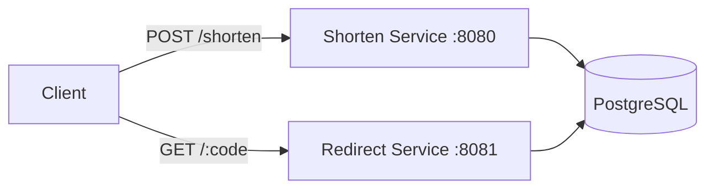

# URL Shortener
A high-performance, containerized URL shortening service built with Go.  
This project was built for learning:

- **GORM Migrations:** Automating schema updates in PostgreSQL
- **Dependency Management:** Handling Go modules and Docker multi-stage builds
- **Service Orchestration:** Networking between Go containers and database containers
- **RESTful Design:** Implementing clean API contracts using the Gin framework

## Tech Stack
- **Language:** Go
- **Web Framework:** Gin Gonic
- **ORM:** GORM
- **Database:** PostgreSQL
- **Containerization:** Docker & Docker Compose
- **Architecture:** Microservices pattern


## Architecture
The application is decomposed into two distinct services that share a single PostgreSQL instance: 



**Shorten Service (Port 8080):**
- Code generation by encoding auto-increment unint64 to base62
- Saving records to PostgreSQL database
```
# Port the service listens on
ADDR=:8080
# The base URL for generated links
BASE_URL=http://localhost:8080

# Use postgre or Go maps for storage
STORAGE=postgre or memory

DB_HOST=postgres16
DB_PORT=5432
DB_USER=postgres16
DB_PASSWORD=postgres16
DB_NAME=urlshortener
DB_SSLMODE=disable
TZ=UTC
```

**Redirect Service (Port 8081):**
- Lookup original URL by given code
- Performing HTTP 302 redirect
```
# Port the service listens on
ADDR=:8081
# The base URL for generated links
BASE_URL=http://localhost:8081

DB_HOST=postgres16
DB_PORT=5432
DB_USER=postgres16
DB_PASSWORD=postgres16
DB_NAME=urlshortener
DB_SSLMODE=disable
TZ=UTC
```


## Getting start
1. [Docker Desktop](https://www.docker.com/products/docker-desktop/) installed
2. Clone the repository
3. Spin up the services: (Go apps + PostgreSQL)
```bash
docker-compose up --build
```
4. Access the API:  
   Shorten service is live at http://localhost:8080  
   Redirect service is live at http://localhost:8081

 

## API Reference

#### Convert a URL to a short URL
```http
POST /shorten
```
**Request**
| JSON Parameter | Type     | Description               |
| :------------- | :------- | :------------------------ |
| `original_url` | `string` | **Required** original url |

**200 Response**
| JSON Parameter | Type     | Description  |
| :------------- | :------- | :----------- |
| `original_url` | `string` | original url |
| `shorten_url`  | `string` | shorten url  |

**500 Response**
| JSON Parameter | Type     | Description   |
| :------------- | :------- | :------------ |
| `error`        | `string` | error message |

#### Redirection
```http
GET /:id
```
**Request**
| URL Parameter | Type     | Description                  |
| :------------ | :------- | :--------------------------- |
| `code`        | `string` | **Required** short URL code. |

**302 Response** if found original URL

**404 Response** if not found original URL


## Roadmap
- Better Error handling
- Better Validation
- Better Logging
- Admin to manage short URL
- Analytics service
- To be added